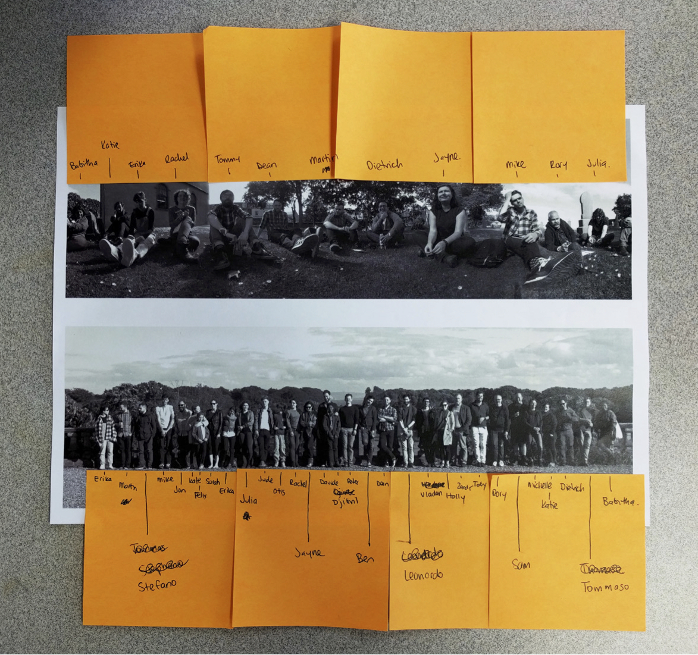

## Healthy networks: the future of IoT is open
_Michelle Thorne_
 
 

*Group photo, Mozilla Open IoT, Anstruther Scotland Design Sprint, June 2016*

 

The internet is changing forms. Today we live in a network of physical objects and services that continuously gather data and exchange it over the internet. These connected systems are increasingly invisible, inaccessible and immutable to us.

We believe that as the internet evolves, it must remain a global public resource that is open and accessible to all.  

The Internet of Things (IoT) describes the trend of increasingly connected objects and environments. It's rapidly growing, although its professional practices and leading products are not yet fully established.

With the Mozilla Open IoT Studio, we’re seeking to make IoT more open, accessible and empowering. We also strive to improve privacy and security in the field. To this end, we’re convening a global network of professionals committed to open IoT.

Here we invite participants to collaborate on prototypes that serve local communities and celebrate the unique affordances of physical places. We test and critique best practices for embedding privacy, digital literacy and diversity & inclusion in IoT. We publish and exhibit our results as a way to reflect and advocate for these values as the internet evolves into more physical and ubiquitous forms.

We prioritize working with professionals who are currently active in IoT: product designers, web developers, hardware manufacturers, data scientists, user researchers, and internet activists. 

That’s because the professional norms of IoT are not yet established. Through collaboration, we develop shared practices and understanding of what it looks like to better embed these values in the technology we build. 

In this way, our work is all about learning-by-making. We want to build a healthy network through collaboration and making something meaningful together. By making a prototype together or project you start to form bonds. These bonds form a network. 

We strive to welcome diverse thinking, identities and experiences. We care about sustainable activities, meaningful contributions to local communities, and a nurtured approach to innovation. We are committed to learning by making and to sharing what we know and create.

These formats are still unusual within Mozilla. That’s because historically, we’re an organization that has primarily defined itself in software and technology products. With software, especially when it’s used by millions of people, there is almost a hubris in thinking that there is a universality in the world. 

Particularly in Silicon Valley, there’s an obsession with ‘fail fast’. It uses hackathons and sprints in a way that’s not necessarily a good thing. We are often failing fast with other people’s lives. It seems reckless, especially if you are trying to do things for others. There’s a need to be supportive and nurturing.

These sorts of events helps Mozilla find its body and its voice. That practice has been growing in different forms with a lot with colleagues that have been doing similar work, particularly with the Mozilla Leadership Network. 

We are here to learn by making and shaping professional practice, especially in technology, because we want IoT to be more open, more accessible. Therefore, we have to think about learning in more holistic and reflective way. It’s about taking the time to listen, observe, be in a place, be present in your practice. You can still be rapidly prototyping, but with a slow philosophy.

This requires meta-cognition. You have to realize the event isn’t just about making a prototype, but about shaping your practice and contributing to a larger community. For that, reflection is vital.

Image caption/credit:
Group photo, Mozilla Open IoT, Anstruther Scotland Design Sprint, June 2016 
