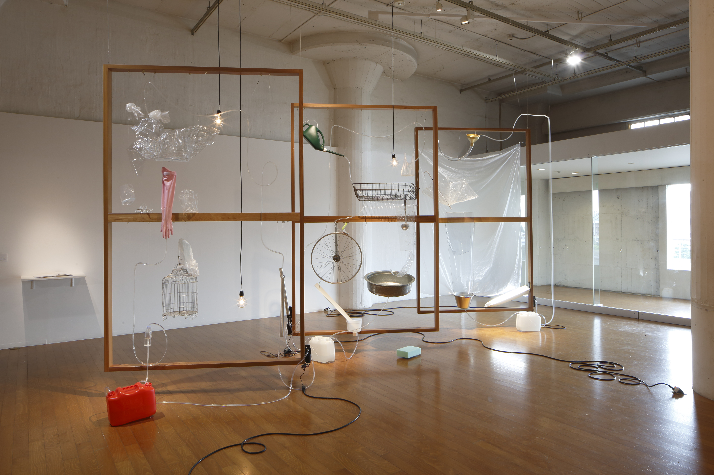
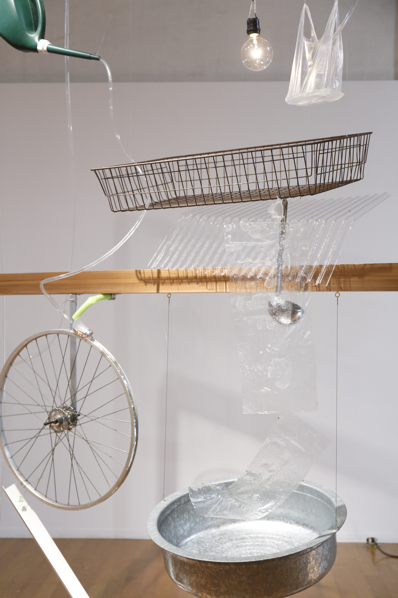

*Image1: Moré Moré (Leaky): The Falling Water Given #1-3, Yuko MOHRI, Nissan Art Award 2015. Photo: Keizo Kioku*

## Theatre of Things

_Edward Ball_
 
 
 
Yuko Mohri produces strange little worlds; theatres of things. Mohri creates idiosyncratic kinetic installations out of found objects, taking readymades and remaking them into curious circuits. 

Primarily an installation artist, Mohri recasts reconfigured everyday items and machine parts that she collects in cities around the world, fashioning them into self-contained ‘ecosystems’. Previous installations have seen Mohri connect together lampshades, bicycle wheels, rubber gloves, dusters, hosepipes, musical instruments, to name just a few. Her installations are frequently free-form – they might spread over the galley floor, across the wall, or more recently, set into a two dimensional frame. 

In whichever configuration, one constant is Mohri’s introduction of an unexpected element – perhaps an electrical current or a flow of water. Mohri frequently looks to her built environment for inspiration, where systems that structure our daily life – transportation, rubbish collection, energy provision – might not always function like clockwork.

Mohri has been working on her series Moré Moré [Leaky] since 2009. A long time resident of Tokyo – where Mohri continues to live and work – the artist became fascinated by the makeshift repairs to water leaks in Tokyo metro stations. In a city otherwise dominated by elegant technological structures and solutions, the decidedly low-tech ‘accidental systems’ constructed by station staff to halt the flow of water are viewed by Mohri as a form of bricolage. Mohri has since produced a range of kinetic installations inspired by this, in which she wires together found materials to contain flowing water. 

Mohri’s series Urban Mining employs the same logic of extrapolating systems around her and creating new whimsical versions. In a recent iteration of the work, Mohri displayed a series of small sculptures comprised of materials recycled from the built environment. Electrified crushed aluminium cans are wired up to model street lamps that illuminate only irregularly; the recycled wires can only complete the circuit when pushed by air currents.

In each work, Mohri recasts systems – leak repairs and streetlights – into new, eccentric circuits where found objects act as intermediaries, persuading environmental forces such as light, gravity and air currents to act upon them. Mohri makes visual the system as much as the objects that are part of it. More than a recontextualisation of the objects she collects, Mohri forces these objects to somehow work together. Yet the artist builds in an element of contingency. 

In fact, Mohri likes for things to go a little wrong. With an artistic background in new-media art, Mohri’s practice engages with circuits and connectivity. She is interested in programming an error into her (decidedly analogue) circuits, but not through her own human intervention. She states that: ‘I prefer gravity, magnetism, light, and wind to control my work.’ Mohri positions forces such as gravity and electricity as otherworldly and unpredictable.

Mohri’s art allies itself to debates in new materialist discourse. ‘New Materialism’  can be characterised by a diverse set of approaches working against anthropocentrism, principally through an emphasis on inhuman forces within human systems. Mohri’s installations also insist on the powers of the nonhuman and the uncontrollable. The artist establishes her systems and then steps back, relinquishing her agency – her circuits are left to their own devices. 

With such a coherent philosophical and artistic approach, Mohri’s work is remarkably diverse in appearance, scale and material. This stems from Mohri’s commitment to research and sheer inquisitiveness. Mohri seeks to bring together found objects, art histories and diverse points of reference in constantly shifting, tinkering installations. For example, in previous sound-based assemblages, Mohri’s approach has alluded to experimental composers Erik Satie and John Cage. The artist’s most recent iteration of  Moré Moré [Leaky] – for which she won the Nissan Art Prize – entered into conceptual dialogue with Marcel Duchamp’s Large Glass from 1915, itself a work characterised by diverse reference points and in-depth research.  

Mohri’s residency at the V&A during Summer 2016 allows her to continue her wide-ranging research. Mohri has been investigating the South Indian collection ahead of her participation in the Kochi-Muziris Biennial in December 2016, and more generally into methods of display and categorisation.  

Mohri as an artist is a collector – of influences, materials and references. The restless quality of her practice reflects her spirit as an artist. There’s something of the mad scientist about Mohri’s artistic approach, which at its base reflects her openness to new ideas and ways of working. Mohri’s art and life seem bound together, caught up in her theatre of things. 

Yuko Mohri (b. 1980) lives and works in Tokyo. Mohri is the recipient of the Nissan Art Award 2015. Mohri was selected as a grantee of the Asian Cultural Council 2014. Her recent major exhibitions include: Yokohama Triennial 2014 (Yokohama Museum of Art, 2014), Sapporo International Art Festival 2014 (Seikaitei and Chi-Ka-Ho, 2014), Unseen Existence (Hong Kong Arts Centre, 2014) and Orochi (Gallery waitingroom, Tokyo, 2013). Mohri’s upcoming exhibitions include THE BEGINNINGS (or Open-Ended) (Minatomachi Potluck Building, Nagoya), The Way Things Go (Taipei Fine Arts Museum, 2016) and Roppongi Crossing 2016 (Mori Art Museum).

Mohri is currently in residence at the V&A as part of the Digital Design Weekend, and will have a residency at Camden Arts Centre in September-October 2016. In February 2017, Mohri will have her first UK solo exhibition at White Rainbow, London.

_Yuko Mohri at the V&A is supported by White Rainbow Gallery, London in association Nissan Art Award coordinating organisation AIT, Tokyo_

*Image2: Moré Moré (Leaky): The Falling Water Given #1-3, Yuko MOHRI, Nissan Art Award 2015. Photo: Keizo Kioku*
