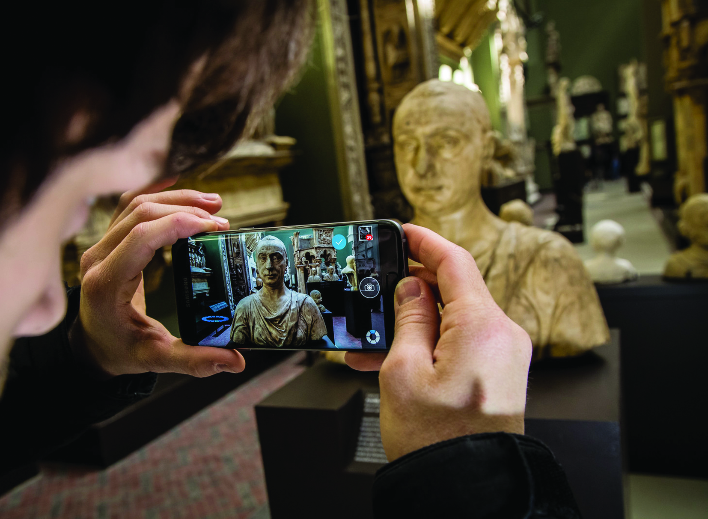

## The V&A Samsung Digital Classroom

_Dubloon_
 
 
 
Digital technology plays a big part in children’s education. More than before it's present in their lives from a very young age and is increasingly integrated into the education system. The development of easy to use portable devices has changed the way students can learn but is being placed within the old framework of education. Most classrooms are still laid out in the same way with children sat in rows of desks facing the front but this isn’t conducive to all types of learning, particularly now this traditional set up is mixed with children having personal devices in front of them. These technologies give us the opportunity to adapt and rethink everything about the ‘learning environment’ so that the physical space compliments the digital tools students use today. 

In February 2016, Samsung and the V&A launched a series of Samsung Digital Classroom workshops which aim to take learning out of the classroom and into the galleries, creating an immersive and contextual learning environment. Dubloon was approached with a very open brief to design this new learning environment. Making use of phones, tablets and laptops, the workshops are inspired by the V&A’s galleries and exhibitions and are designed to provide young people with the digital skills needed to equip them for a career in the creative industries including art, fashion, design and product development. The programme ranges from topics such as – projection mapping, virtual reality, 3D printed jewellery and digital animation among others.    

With this rise of learning through digital devices the classroom can become a much more flexible space allowing the physical environment to be redesigned to best aid creative thinking and learning. This drove Dubloon to experiment with various classroom formats and consequently they developed an easy to assemble structure that defines a space with little restriction, an open learning environment within the gallery spaces of the V&A to immerse teaching, learning and inspiration in the same physical environment. This provides an exciting space for the workshops to take place being amongst the exhibits so that participants have the ability to use them as reference, inspiration or directly within their work using 3D scanning and other forms of technology.

Part of the challenge was to design a pop up structure that can be easily assembled and clearly defines a non public space for the workshop to happen within the public galleries. Using tubes of light as the material the structure creates an attractive environment to work without putting up solid barriers. The tubes create a visually unobtrusive space within a space, framing an area while the public are still able to see the excitement of the workshop happening. The structure is not the absolute defining parameter for the workshop with large entry and exit points designed to allow the movement of people encouraging a more dynamic style of learning to take place. Along with the structure there are additional pieces of mobile furniture which facilitate the running of any workshop, from the storage unit which was designed with integrated steps to assist the assembly of the structure, to lightweight aluminium trestles and glass table tops which fit onto the storage unit for transit and are quick and easy to setup. The glass tables can be drawn on with marker pens to aid the development of the children's ideas in a free flowing fun way. We hope other educational spaces adapt to compliment the way children are learning, particularly as digital technology moves forward and the methods of learning adapt.

_Dubloon a London based design consultancy founded by James Boock and Henry Franks in 2015 after graduating together from the Royal College of Art. The studio works on product development, experience design and physical branding. They have worked on various projects with musicians, scientists and psychologists to produce considered work with a focus on original and exciting experiences._

[*Dubloon*](http://www.dubloon.co.uk)

_Special thanks to Alex Flowers, the V&A Learning team and Samsung_

_Image: Dubloon_
