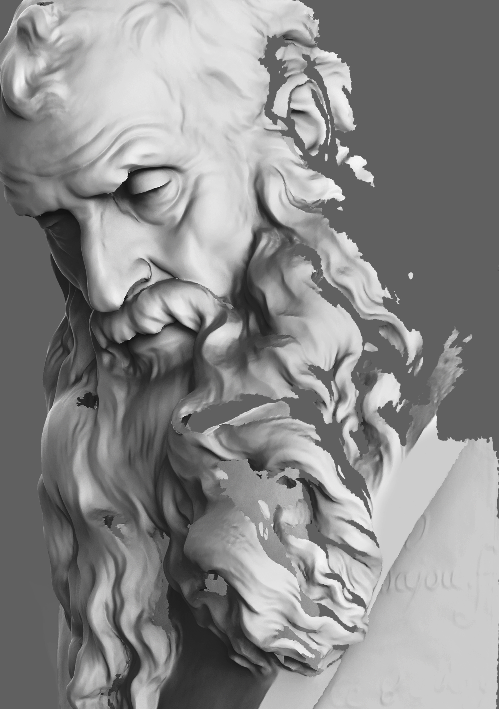

_Image: Bust of bearded man_

## Scan the World

_Jonathan Beck_
 
 
 
For people who would like to see particular objects of cultural significance in person but are unable to do so, or even own their own version, Scan the World makes this all possible using 3D scanning and printing technologies, where a series of overlapping photographs are taken of a physical object or environment to create a three dimensional representation of it. 

Scan the World is a non-profit initiative aiming to give people the chance to experience representations of artifacts in a remarkably tangible way, enabling the public to obtain content that they may never had physical access to otherwise. By also facilitating the proliferation of 3D scanning and printing, the project makes the public aware of its uses and how the technologies are becoming an ever increasing part of our lives. By bridging the gap between technology and the public, the project has become a community built platform, encouraging people to get involved in different ways which are rewarding and easy to do. Scan the World serves as a growing, living archive built by and for the public. The data that is collected for the objects is curated by users and professionals alike, serving as a concept for an open access museum of the future. Once made printable, these objects can be brought back into the physical world and in turn be used for numerous outputs:

### Cultural Heritage

Cultural heritage is crucial to how we see ourselves as people and is important for historical research and education. It reflects our long historical past as human beings , giving people a sense of identity and a documented past. Cultural heritage comes in many forms, whether that be in a particular belief, object, monument, ritual or tradition. Damage or complete demolition of cultural sites would mean, in a sense, losing one’s identity as well as impacting the economic benefits that the heritage site or monument can produce for the community it is in. This loss has become increasingly apparent in recent times with environmental changes and human conflicts across the globe. Scan the World’s intention is to simply preserve endangered cultural heritage by digitally producing facsimiles of these objects which in turn create valuable records of culture. As a result, potential risk of damage and destruction are mitigated.

### Accessibility 

What does a museum’s collection, a public sculpture or even a building mean to those who are partially sighted or blind? The traditionally enforced rule of ‘don’t touch the artwork’ makes accessing culture close to impossible for people who have visual impairments. By being such a cheap means of producing accurate representations of these objects with intricate detail, Scan the World makes it very easy to give someone the incredible experience of touching and engaging with artwork. Similarly, for someone living in Australia wanting to explore the V&A’s collection, the virtual archive not only allows people to ‘visit’ a museum’s collection, but also to print it.

For many smaller communities whose culture is not globally recognized or is at risk of being damaged or destroyed, Scan the World serves as a platform for copies of these objects to be placed in a rightful location and shared with a global audience.

### Education

Many educational institutions are starting to think about how 3D technologies can be useful for their students and there is added pressure to implement it into the school’s curriculum. Scan the World provides a platform for people to learn about about the technology, from generating a digital representation of a scene or object (photography and photogrammetry software), to the manipulation of it (zBrush/modelling software) and the output of 3D printing. Additionally, it teaches students about the artworks in ways which are stimulating and interactive. It is important to be present with the piece and seeing its physical form in 3D as opposed to 2D makes it easier to understand what the artist is trying to portray and how they have achieved this by being able to  move and touch it to study the transitions of space, angles and light.

As part of the London Design Festival 2016, Scan the World digitized most of the three dimensional artifacts in the V&A’s New Europe galleries. All of these are made available on www.myminifactory.com/stw alongside more than 4,000 other artifacts in the archive from across the world.
